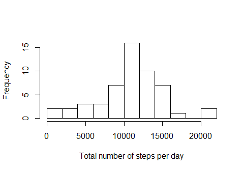
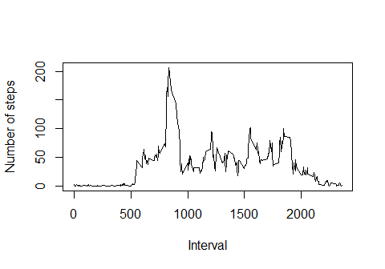
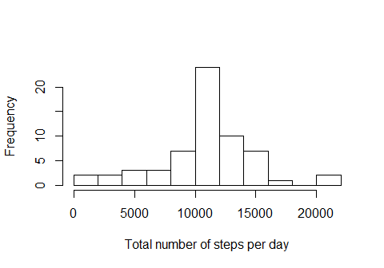
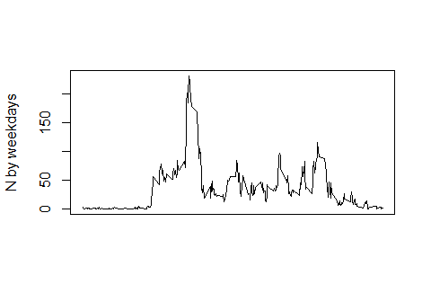
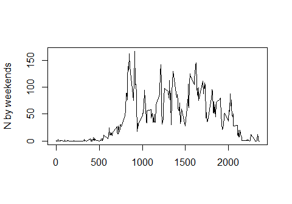

# Reproducible Research: Peer Assessment 1
## Reading and processing data

```r
Sys.setlocale("LC_TIME", "English")
```

```
## [1] "English_United States.1252"
```

```r
download.file(url="https://d396qusza40orc.cloudfront.net/repdata%2Fdata%2Factivity.zip",destfile="amd.zip")
amd<-read.csv(unz('amd.zip','activity.csv'))
amd$date<-as.Date(amd$date)
```

## Total number of steps taken each day

```r
daily.total<-tapply(amd$steps,amd$date,sum)
```

```r
hist(daily.total,breaks=15,main='',xlab='Total number of steps per day')
```

<!-- -->

### Mean and median number of steps taken each day

```r
mean(daily.total,na.rm=TRUE)
```

```
## [1] 10766.19
```

```r
median(daily.total,na.rm=TRUE)
```

```
## [1] 10765
```
## Average number of steps taken

```r
amd2<-na.omit(amd)
mean.per.int<-tapply(amd2$steps,amd2$interval,mean)
```


```r
plot(as.numeric(names(mean.per.int)),mean.per.int,type='l',xlab='Interval',ylab='Number of steps')
```

<!-- -->

### Interval with max n of steps
Interval #835 with mean of 206.17 steps

```r
mean.per.int[which.max(mean.per.int)]
```

```
##      835 
## 206.1698
```

## Imputing NAs

I decided to use avg number of steps per interval to impute insted of missing steps data because there is a clear daily structure according to plot. For it I use vector of means per interval


```r
sum(is.na(amd$steps)); amd$steps[1:10]; amd$steps[1001:1010]
```

```
## [1] 2304
```

```
##  [1] NA NA NA NA NA NA NA NA NA NA
```

```
##  [1]   0 180  21   0   0   0   0   0 160  79
```

```r
for (i in 1:length(amd$steps)) {
     if(is.na(amd$steps[i])) {
        amd$steps[i]<- mean.per.int[which(as.integer(names(mean.per.int)) == amd$interval[i])]
    }
}

sum(is.na(amd$steps)); amd$steps[1:10]; mean.per.int[1:10]; amd$steps[1001:1010]
```

```
## [1] 0
```

```
##  [1] 1.7169811 0.3396226 0.1320755 0.1509434 0.0754717 2.0943396 0.5283019
##  [8] 0.8679245 0.0000000 1.4716981
```

```
##         0         5        10        15        20        25        30 
## 1.7169811 0.3396226 0.1320755 0.1509434 0.0754717 2.0943396 0.5283019 
##        35        40        45 
## 0.8679245 0.0000000 1.4716981
```

```
##  [1]   0 180  21   0   0   0   0   0 160  79
```
So, all the NAs are imputed with mean per interval values, non-missing values remained the same.

### Histogram of the total number of steps taken each day after missing values are imputed


```r
daily.total.imp<-tapply(amd$steps,amd$date,sum)
```

```r
hist(daily.total.imp,breaks=15,main='',xlab='Total number of steps per day')
```

<!-- -->

```r
mean(daily.total.imp)
```

```
## [1] 10766.19
```

```r
median(daily.total.imp)
```

```
## [1] 10766.19
```

Mean havent changed at all, median had almost n change also, but after imputing equals exatly to the mean

## Difference in weekdays and weekends

First i created new variable to indicate weekdays and weekends. The i subsetted weekdays/ends and computed average n per interval for each group.


```r
for (i in 1:length(amd$date)){
      if (weekdays(amd$date[i])=='Saturday'||weekdays(amd$date[i])=='Sunday') {
          amd$wd[i]<-'Weekend'
      }else{
          amd$wd[i]<-'Weekday'
      }
}
weekday<-amd[amd$wd=='Weekday',]
weekend<-amd[amd$wd=='Weekend',]
mean.per.int.wd<-tapply(weekday$steps,weekday$interval,mean)
mean.per.int.we<-tapply(weekend$steps,weekend$interval,mean)
```

### Average number of steps per interval by weekdays and weekends


```r
layout(1:2)
par(oma=c(5,4,0,0),mar = c(0,4,0,0) + 0.1)
```

```r
plot(as.numeric(names(mean.per.int.wd)),mean.per.int.wd,type='l',xlab='',ylab='N by weekdays',main='',xaxt='n')
```

<!-- -->

```r
plot(as.numeric(names(mean.per.int.we)),mean.per.int.we,type='l',xlab='',ylab='N by weekends')
title(xlab = "Interval", outer = TRUE, line = 3)
```

<!-- -->
